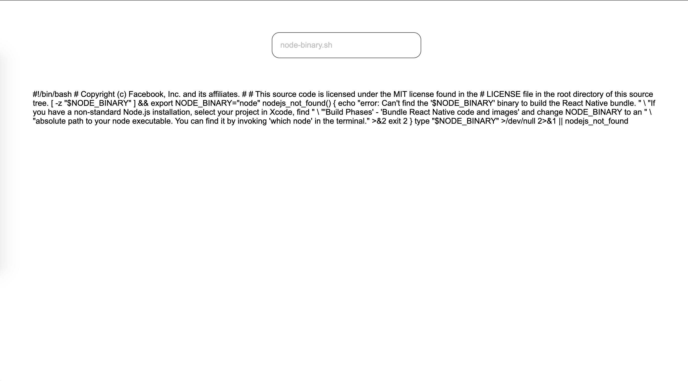

# Read file Challenge

- Criar uma simples classe que possa ler o conteúdo de um arquivo texto. Essa classe deverá conter um atributo privado que será usado para guardar o conteúdo do arquivo lido, um método para carregar o arquivo e outro para visualizar o atributo.
  Utilizando a classe criada acima, criar um form que solicite ao usuário um arquivo e que ao submeter seja visualizado o conteúdo.

## Result

