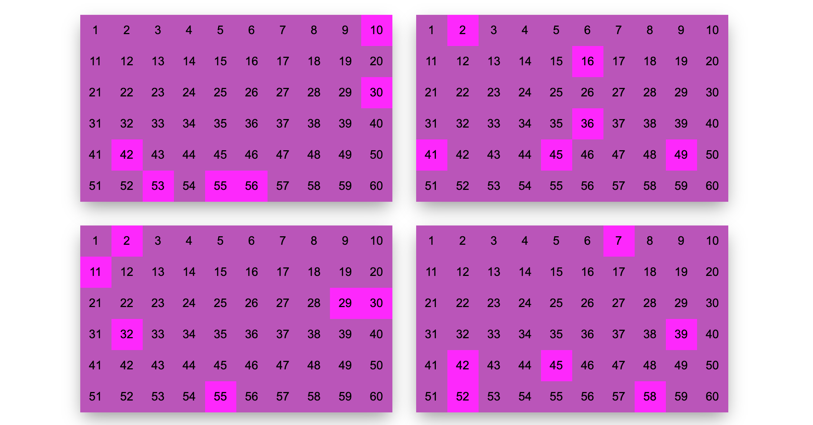

# Megasena Challenge

- Criar uma função que retorne um array com 6 dezenas aleatórias entre 1 e 60, atentando que os números nunca se repitam e que estejam na ordem crescente.

- Utilizando a função acima e pensando num volante da Megasena, criar um layout html contendo 3 tabelas com 10 colunas e 6 linhas numeradas com as 60 dezenas e destacando com a cor roxa [#ff00ff] os números sorteados. Para isso, deverão constar 3 apostas não repetidas. Há várias formas de resolver, porém, essa atividade não será avaliada pelo layout e sim pela lógica e organização do código.

## Result

